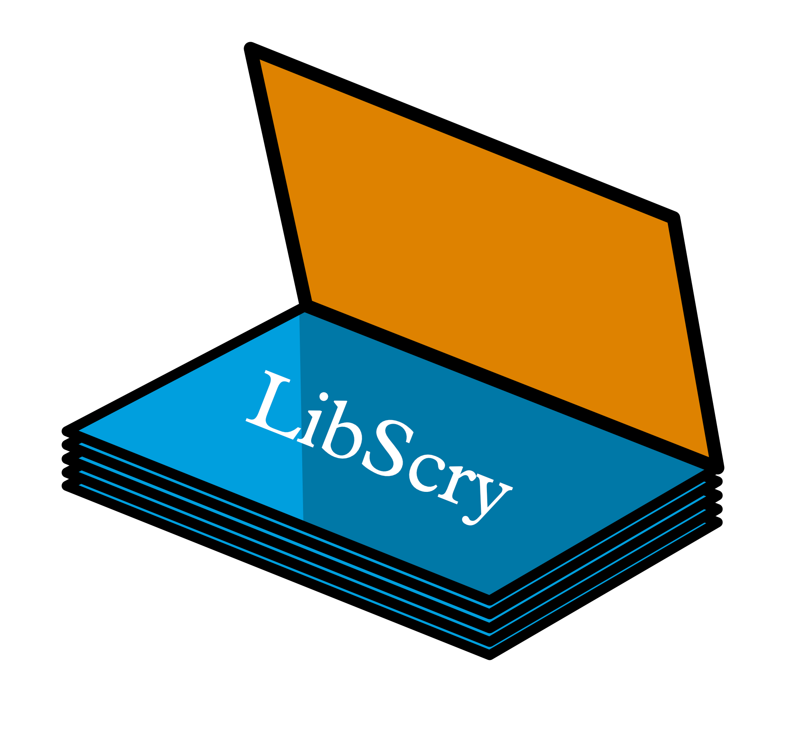

# libscry - Standalone scryfall query syntax library

`libscry` is a standalone Scryfall Query Language parser library - allowing scryfall search syntax to be implemented
in your applications without calling the official scryfall API.

## Development Disclaimer
The intention for the future is that this repo will become a standalone library with no additional functionality provided,
but for the time being while it's in the depths of early development a small test client is included in `main.go`.
Intended SDK functionality for this library has not yet been finalised - expect changes in this as development moves forwards.

See the projects tab for more information on how things are progressing.